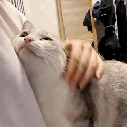

<html>
<head>
<meta charset="utf-8">
</head>
<title>
Сайт Труляля
</title>
<body style="background-color: yellow">

<h1>
Труляля, труляля, труляляляля!
</h1>

КАК СТАТЬ СЧАСТЛИВЫМ.
<ol type="1">
Вот три первых шага:
<li>Вы ОБЯЗАТЕЛЬНО должны иметь котика.
<li>Посадите котика на кровать.
<li>Гладьте котика и при этом говорите "Утю - тю - тю - тю!"

Вот и всё! Теперь вы счастливые!

